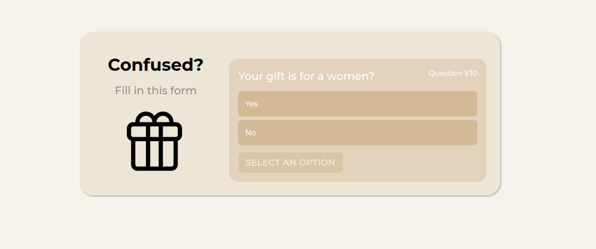
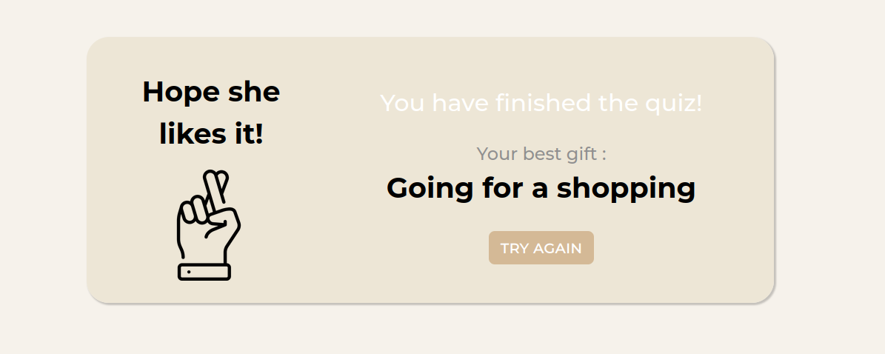

# Project guide

## Overview

This project is an expert system designed to assist you in selecting the best gift to offer, based on your answers, developped with VueJs and Django.

## Project setup

### Install required dependencies

```
npm install
```

### Install python

```
sudo apt install python3.9
```

### Install pip

```
sudo apt install python3-pip
```

### Compiles and hot-reloads for development

```
npm run start
```

## Interfaces of the application

Question example:



Result:


